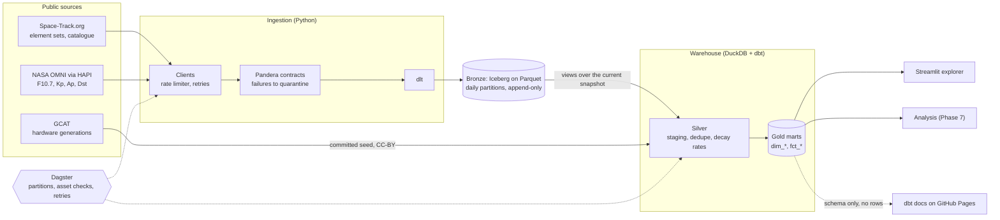
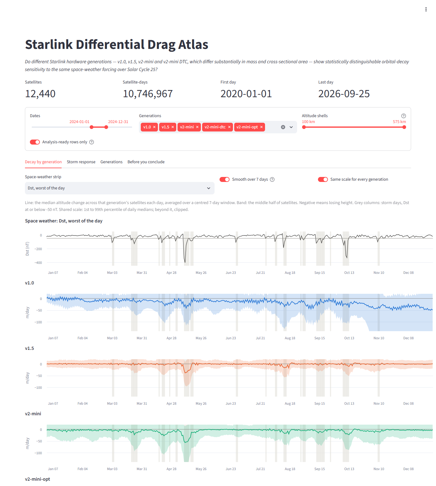

# Starlink Differential Drag Atlas

[](https://github.com/aviral-shrivastava-dev/heliodrag/actions/workflows/ci.yml)
[](https://github.com/aviral-shrivastava-dev/heliodrag/actions/workflows/nightly.yml)

A reproducible pipeline that measures how fast every Starlink satellite loses
altitude, every day since 2020, and lines that up against the space weather
that drives it, so that Starlink's hardware generations -- which differ several
times over in area-to-mass ratio -- can be compared under the same forcing. It
lands orbital elements from Space-Track and solar and geomagnetic indices from
NASA into an append-only Iceberg lake, models them with dbt in DuckDB into
tested gold marts, runs everything as partitioned Dagster assets, and serves the
marts through a Streamlit explorer. It runs on a laptop, costs nothing, and
starts from one command.



[Architecture](docs/architecture.md) ·
[dbt docs and lineage](https://aviral-shrivastava-dev.github.io/heliodrag/) ·
[Runbook](docs/runbook.md) ·
[Data dictionary](docs/data_dictionary.md) ·
[Decisions](docs/adr/README.md)

## The research question

> Do different Starlink hardware generations -- v1.0, v1.5, v2-mini and v2-mini
> DTC, which differ substantially in mass and cross-sectional area -- show
> statistically distinguishable orbital-decay sensitivity to the same
> space-weather forcing (F10.7, Ap, Kp, Dst) over Solar Cycle 25?

A satellite with more area per kilogram feels more drag, so the naive answer is
yes. Measuring it is harder than it sounds, and the pipeline is built around why:

- **Operational satellites station-keep.** An ion thruster cancels the very drag
  being measured, so a generation can look drag-free while fighting hard. Storms,
  when drag briefly outruns the thrusters, are where the signal survives, which is
  why storms get their own mart and their own view in the explorer.
- **Retired satellites are commanded down.** Most v1.0 satellites have been
  deorbited on purpose, and that deliberate descent swamps a naive average.
- **Generation and date are entangled.** Each generation flew at a different
  point in the solar cycle, so the date has to be controlled for as well as
  altitude.
- **The question predates its largest generation.** v2-mini-opt, now the biggest
  group, is tracked throughout but is not one of the four named.

The confounders are columns in the gold marts rather than filters, so the
statistical comparison (Phase 7) can condition on them openly. The explorer
shows the data; it does not answer the question.

## Run it locally

You need [uv](https://docs.astral.sh/uv/getting-started/installation/), git,
and a free [Space-Track account](https://www.space-track.org/auth/createAccount).
Sign up before you start: the account has to be working before the command can
use it. uv installs the right Python by itself.

```bash
git clone https://github.com/aviral-shrivastava-dev/heliodrag.git
cd heliodrag
cp .env.example .env
```

Open `.env` and fill in the two Space-Track lines with your login. Then:

```bash
uv run starlink-drag demo
```

That one command installs everything, lands the most recent 30 days of Starlink
orbits and space weather, builds and tests every model, and starts the explorer.
Open **http://localhost:8501**. From a fresh clone it took about seven minutes
end to end, most of it installing packages, and uses about 1.5 GB of disk, most
of that the Python environment. Stop it with Ctrl+C.

No data ships with this repository: Space-Track's user agreement forbids
redistributing it, so everyone fetches their own
([ADR-0007](docs/adr/0007-publish-schema-and-aggregates-never-element-data.md)).
The command respects Space-Track's rate limit on its own.

**Afterwards**

| Command | What it does |
| --- | --- |
| `uv run starlink-drag app` | Reopen the explorer on what you already have |
| `uv run starlink-drag backfill` | The full history, 2020 to today: hours, almost all of it waiting on the rate limit |
| `uv run pytest` | The test suite. Offline; never touches Space-Track |
| `uv run dagster dev -m starlink_drag.definitions` | The Dagster UI and asset graph, at http://localhost:3000 |

If something fails, [docs/runbook.md](docs/runbook.md) covers what has actually
gone wrong so far, starting with credentials, rate limits and Windows paths. The
Makefile wraps the same commands (`make demo`, `make test`) for those with
`make` installed; nothing requires it.

### Or run it the way production would: Docker

`infra/docker` runs the same pipeline as services: SeaweedFS as the lake,
standing in for Cloudflare R2, and Dagster's web UI and scheduler. It needs Docker
Desktop as well as the `.env` above, and the first build takes a few minutes.

```bash
docker compose -f infra/docker/docker-compose.yml up -d --build
```

Dagster is then at **http://localhost:3000**, and the lake's files can be
browsed at **http://localhost:8888/buckets/**. Land and model a few days inside
the stack -- any range works:

```bash
docker compose -f infra/docker/docker-compose.yml exec dagster-webserver starlink-drag backfill --start 2026-09-15 --end 2026-09-16
```

That lake lives in SeaweedFS, separate from the one `demo` builds on your disk.

**Already have a lake on disk?** Copy it into the stack instead of downloading
it again. No API calls; every table's row count is checked against the source,
and a copy that dies part-way can simply be run again. Then build the
warehouse inside the stack:

```bash
LAKE_BACKEND=r2 LAKE_ENDPOINT_URL=http://localhost:8333 LAKE_ACCESS_KEY_ID=atlas LAKE_SECRET_ACCESS_KEY=atlas-local-only uv run starlink-drag lake-copy
docker compose -f infra/docker/docker-compose.yml exec dagster-webserver dagster asset materialize -m starlink_drag.definitions --select "group:warehouse,group:silver,group:gold"
```

Run ingestion in one place at a time: each keeps its own record of Space-Track
requests. Stop the stack with
`docker compose -f infra/docker/docker-compose.yml down`.

## Sample output



The explorer on 2024, the year Solar Cycle 25 peaked, opened at
`http://localhost:8501/?start=2024-01-01&end=2024-12-31` -- any view's dates
can be linked this way. Each panel is one hardware generation: the line is the
median daily change in altitude across its satellites, averaged over a week, and
the band holds the middle half of them. The strip on top is Dst, which plunges
during geomagnetic storms; storm days are shaded down through every panel. The
deepest dip, in May, is the strongest storm in two decades (Dst -406 nT), when
drag outran the thrusters of every generation at once. v1.0's steady fall
through the year is something else: retired satellites being brought down on
purpose.

The image shows per-generation aggregates only, which are derived products and
publishable; the element-level data behind them is not.

## Stack

| Layer | Choice | Why this, rather than the obvious alternative |
| --- | --- | --- |
| Packaging | uv, `src/` layout, committed `uv.lock` | Reproducible installs fast enough to run on every CI push ([ADR-0001](docs/adr/0001-packaging-with-uv.md)) |
| Ingestion | httpx clients + dlt | The clients own rate limiting and retries, which must be exact; dlt owns the write, which should be boring |
| Validation | Pandera, with a quarantine table | A bad row is kept with its reason, not dropped silently or loaded silently |
| Lake | Apache Iceberg on Parquet: local disk, or S3-compatible storage | Snapshots make "which files are current" a fact rather than a directory listing. The same code writes to a local folder or to any S3 server, tested against SeaweedFS in CI ([ADR-0010](docs/adr/0010-one-lake-module-for-every-storage-backend.md)) |
| Engine | DuckDB + Polars | The whole dataset is a few gigabytes. A single process is faster, cheaper and easier to reason about than a cluster |
| Transformation | dbt-core + dbt-duckdb | Versioned, tested SQL with lineage a reviewer can read; 84 tests on every build |
| Orchestration | Dagster | Partitioned assets make backfills and per-day idempotency the default, not a convention ([ADR-0002](docs/adr/0002-dagster-over-airflow.md)) |
| Serving | Streamlit + Altair | Reads gold marts only, through connections that never block a build ([ADR-0006](docs/adr/0006-explorer-reads-gold-through-short-lived-connections.md)) |
| Infrastructure | Terraform (Cloudflare R2), docker-compose (SeaweedFS + Dagster) | The production lake, and a local stack that runs the whole pipeline against the same S3 API |
| CI | GitHub Actions | Tests and a real dbt build on every push; a nightly check that the upstream APIs have not changed shape |

## Monthly cost

**$0.** Everything runs on the machine you run it on, and every source is free.

| Item | Cost |
| --- | --- |
| Space-Track, NASA OMNI, GCAT | Free |
| Compute | Your laptop. The full six-year backfill is a few hours of mostly waiting |
| GitHub Actions and Pages | Free for a public repository |
| Lake on Cloudflare R2, when deployed | $0: about 3 GB for 2020 to 2026, inside R2's free 10 GB-month. Past the free tier it is $0.015 per GB-month -- five cents a month at this size -- and R2 charges nothing for egress |
| R2 operations | $0: a nightly build reads a few thousand files, against 10 million free reads a month |

The R2 bucket is defined in `infra/terraform` and validated, but has not been
applied: that needs a Cloudflare account and token.

## Trade-offs and future work

**Trade-offs made on purpose**

- **One machine, not a cluster.** DuckDB comfortably handles the few gigabytes
  this dataset occupies, held to a 4 GB memory budget and spilling to disk
  beyond it ([ADR-0009](docs/adr/0009-bounded-memory-warehouse-build.md)). The
  ceiling is roughly the laptop's disk; well before that, the next step would be
  a hosted DuckDB or Trino, not Spark.
- **Bronze appends; silver deduplicates.** Replacing partitions in Iceberg was
  measured at two hundred times slower than appending
  ([ADR-0005](docs/adr/0005-bronze-appends-rather-than-replaces.md)). The price is
  duplicate rows in bronze and superseded files that lifecycle rules must clean up.
- **Views over file lists instead of `iceberg_scan`.** DuckDB cannot read this
  Iceberg lake on Windows, so each build re-points views at the current
  snapshot's files. It works everywhere; it is one more step that must run.
- **A filesystem Iceberg catalog.** No catalog service to run, and exactly one
  writer. More writers would need a REST catalog.
- **No hosted explorer, no sample data.** Both would redistribute Space-Track
  data. A newcomer needs an account and a few minutes instead of a link.
- **Streamlit, not a BI tool.** Quick to build, versioned with the code, and
  held to the same tests. It is not a multi-user dashboard, and does not try to be.

**Known limits**

- The rate limit is enforced per machine. Every process on it shares one
  ledger of recent requests, so retries and parallel runs cannot exceed it
  ([ADR-0008](docs/adr/0008-rate-limit-shared-across-processes-and-resumable-fetch.md)),
  but it cannot see requests from another machine on the same account. The
  defaults leave headroom for the nightly check on GitHub; ingestion on two
  machines would need its budget split
  ([runbook](docs/runbook.md#rate-limit-exhaustion)).
- **R2 is not deployed.** The S3 path is tested against SeaweedFS, locally and
  in CI, and is the code R2 would use; creating the bucket needs a Cloudflare
  account and token. Until 2026-09-26 the S3 path did not work at all -- Phase 4
  had checked that the Docker stack starts, not that data flows through it
  ([ADR-0010](docs/adr/0010-one-lake-module-for-every-storage-backend.md)).
- DuckDB 1.5.5 was found to build one mart from a fraction of its input inside
  `CREATE TABLE AS`. The model now avoids the pattern that triggers it, and a
  dedicated test would catch a recurrence ([runbook](docs/runbook.md#checks-that-are-failing)).

**Future work**

- **Phase 7, the analysis:** a per-generation regression of decay on
  space-weather forcing with bootstrap confidence intervals, conditioned on
  altitude shell, date and manoeuvring, and a superposed-epoch comparison of
  storm responses.
- Deploy the lake to R2 -- the code path is already tested against SeaweedFS -- and
  move the nightly ingest onto it.
- A minimal, shareable reproduction of the DuckDB bug for the DuckDB project.
- A hosted, aggregates-only explorer, which would be publishable.
- Phase 6, a streaming drag nowcast, is optional and not planned: nothing in
  the research question needs sub-daily latency.

## Layout

```
src/starlink_drag/
  science/   pure functions, zero I/O: orbital mechanics, generation labelling
  clients/   the only modules that make network calls
  schemas/   Pandera contracts applied at the ingestion boundary
  ingest/    landing sources into bronze
  defs/      Dagster wiring only; no business logic
  serving/   the explorer's queries and charts
transform/   the dbt project: staging -> intermediate -> marts
app/         the Streamlit explorer: layout only
analysis/    notebooks and figures (Phase 7); never imported by src/
infra/       Terraform for R2, docker-compose for SeaweedFS and Dagster
```

## Data and licensing

Code is MIT licensed. Space-Track data is **not** redistributed: it is covered
by a US-government user agreement. `data/` is gitignored, CI fails if anything
under it is tracked, and a pre-commit hook refuses such a commit. Only derived
products -- aggregates, the schema, figures -- are published.

NASA OMNI data, obtained through the SPDF HAPI server, is public domain.
Generation labels derive from Jonathan McDowell's
[GCAT](https://planet4589.org/space/gcat/) (CC-BY).

## Build order

| Phase | Scope | State |
| --- | --- | --- |
| 0 | Scaffold: packaging, tooling, CI, ADRs | done |
| 1 | Ingestion: Space-Track and HAPI clients, dlt into bronze Iceberg | done |
| 2 | Transformation: dbt staging, intermediate, marts | done |
| 3 | Orchestration: partitioned Dagster assets, asset checks, CLI parity | done |
| 4 | Hardening: coverage, integration tests, nightly CI, runbook, Terraform | done |
| 5 | Serving: Streamlit explorer, this README, published dbt docs | **done** |
| 6 | Streaming (optional): drag nowcast | not planned |
| 7 | Analysis: per-generation regression with bootstrap CIs, figures | next |

## Documentation

Every phase is documented twice: once for people who build data pipelines, and
once for people who do not. The plain-language versions use fewer assumed words,
not fewer facts.

| | Technical | Plain language |
| --- | --- | --- |
| What this project is, and why the science is hard | [overview.md](docs/phases/overview.md) | [overview-plain.md](docs/phases/overview-plain.md) |
| Phase 0: scaffold | [phase-0.md](docs/phases/phase-0.md) | [phase-0-plain.md](docs/phases/phase-0-plain.md) |
| Phase 1: ingestion | [phase-1.md](docs/phases/phase-1.md) | [phase-1-plain.md](docs/phases/phase-1-plain.md) |
| Phase 2: transformation | [phase-2.md](docs/phases/phase-2.md) | [phase-2-plain.md](docs/phases/phase-2-plain.md) |
| Phase 3: orchestration | [phase-3.md](docs/phases/phase-3.md) | [phase-3-plain.md](docs/phases/phase-3-plain.md) |
| Phase 4: hardening | [phase-4.md](docs/phases/phase-4.md) | [phase-4-plain.md](docs/phases/phase-4-plain.md) |
| Phase 5: serving and documentation | [phase-5.md](docs/phases/phase-5.md) | [phase-5-plain.md](docs/phases/phase-5-plain.md) |
