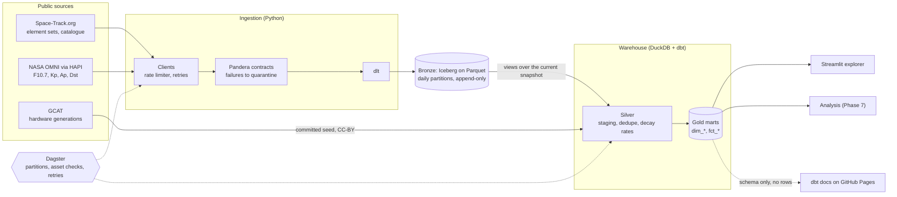

# Architecture

One path, from two public APIs to a set of tested gold marts, run by one
orchestrator on one machine. Everything below it serves those marts: the
explorer reads them, the analysis will read them, and the published docs
describe them.

The diagram's source is [architecture.mmd](architecture.mmd). The README embeds
the same diagram, and a test fails if the two drift apart.

## The layers, and why each is shaped the way it is

### Sources

| Source | What it supplies | Terms |
| --- | --- | --- |
| Space-Track `gp_history` | Every orbital element set for every Starlink since 2020 | Free account; **not redistributable** |
| Space-Track `satcat` | Launch date, decay date, object type | Free account; not redistributable |
| NASA OMNI, via the SPDF HAPI server | Hourly F10.7, Kp, Ap, Dst | Public domain |
| GCAT (Jonathan McDowell) | Spacecraft bus and mass, hence hardware generation | CC-BY; the derived seed is committed |

### Ingestion — `src/starlink_drag/clients`, `schemas`, `ingest`

- **Clients** are the only modules that touch the network. Space-Track's limit
  (fewer than 30 requests a minute and 300 an hour) is enforced by a sliding
  window before the first request is sent ([ADR-0003](adr/0003-sliding-window-rate-limiter.md)).
  The limiter counts one process's requests, so two Space-Track-heavy
  processes run back to back must leave an hour between them; see the runbook.
- **Pandera contracts** check every row at the boundary. A row that fails is
  quarantined with its payload and the reason, not dropped and not loaded.
- **Empty answers are treated as suspicious.** A throttled Space-Track returns
  HTTP 200 with an empty array; a window that comes back empty while its
  neighbours do not fails the run instead of recording a quiet gap.
- **dlt** writes Arrow tables into Iceberg, so no `_dlt_*` columns appear and a
  re-run can be compared byte for byte.

### Bronze — Iceberg on Parquet

Daily partitions, **append-only** ([ADR-0005](adr/0005-bronze-appends-rather-than-replaces.md)):
replacing partitions was measured at 200 times slower than appending, so
duplicates are allowed to land and are collapsed in silver. Load provenance
lives in a separate audit table, not in the data files.

The lake is a directory under `data/`, or an S3-compatible bucket with
`LAKE_BACKEND=r2`: MinIO from `infra/docker`, or Cloudflare R2 from
`infra/terraform`. `starlink_drag.lake` builds each tool's view of it -- dlt's
credentials, pyiceberg's properties, DuckDB's secret, the variables dbt's
profile reads -- from one set of settings, so they cannot disagree. The S3 path
is tested against MinIO in CI
([ADR-0010](adr/0010-one-lake-module-for-every-storage-backend.md)).

### The bridge into the warehouse — `src/starlink_drag/warehouse.py`

DuckDB's `iceberg_scan` cannot read this lake on Windows, so each bronze table
is exposed as a DuckDB view over **exactly the files in its current Iceberg
snapshot**, never over a directory listing — Iceberg leaves superseded files on
disk, and a listing would mix them back in. Every dbt build re-syncs the views
first.

### Silver and gold — `transform/`

Medallion layers are dbt **tags**, not folders.

- **Silver** (views): staging casts and renames; intermediate models collapse
  duplicates, attach generation labels from the GCAT seed, and derive daily
  decay rates. The orbital formulas exist twice, in Python
  (`science/orbital.py`) and as SQL macros, and 57 tests pin the two together.
- **Gold** (tables): `dim_satellite`, `dim_generation`, `fct_daily_decay`,
  `fct_space_weather_daily`, `fct_storm_epoch`. Confounders -- altitude shell,
  manoeuvring, interval, date -- are columns rather than filters, so an analysis
  conditions on them in the open.

84 dbt tests run with every build, including singular tests of the physics --
for example, that extreme decay only occurs at altitudes where it is possible.

### Serving — `app/`, `src/starlink_drag/serving`

The Streamlit explorer reads the **gold marts and nothing else**, through
connections that are opened read-only for one query and closed at once
([ADR-0006](adr/0006-explorer-reads-gold-through-short-lived-connections.md)).
DuckDB allows one writer, so an explorer holding the file open would stop the
next build.

### Publishing — `.github/workflows/docs.yml`

The dbt docs are built against a warehouse **created empty** for the purpose,
so the published page has every model, column type and lineage edge and no
data ([ADR-0007](adr/0007-publish-schema-and-aggregates-never-element-data.md)).

### Orchestration — `src/starlink_drag/defs`

Dagster assets map one-to-one onto the layers: three ingestion assets (daily
partitions, `BackfillPolicy.single_run`, exponential-backoff retries), a
multi-asset that syncs the bronze views, and the dbt project loaded through
dagster-dbt: 22 assets in all. The dbt tests surface in Dagster as asset
checks, alongside freshness and volume checks: 87 in all. A daily schedule
materialises the newest partition. Every operation is also reachable from the
`starlink-drag` CLI, so a plain scheduler could drive the same code.

### Quality gates outside the pipeline

| Gate | Where | What it catches |
| --- | --- | --- |
| Unit and integration tests | `tests/`, CI on every push | Logic, and a real `dbt build` against a synthetic warehouse |
| Coverage floor | `make test-science` | `science/` dropping below 90% |
| Upstream contract check | nightly workflow | Space-Track or NASA changing the shape of a response |
| Data dictionary | `docs/data_dictionary.md` | Generated from dbt, so it cannot go stale by hand |

## What is deliberately absent

No Kafka, Spark or Kubernetes. The whole Solar Cycle 25 dataset is a few
gigabytes and fits on a laptop; a cluster would add cost and failure modes and
answer no question this project asks.
